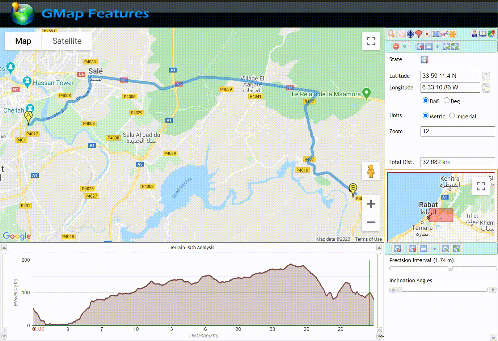
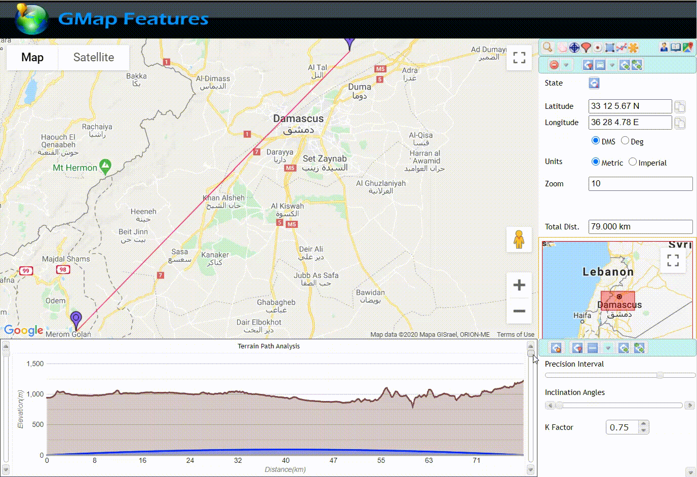
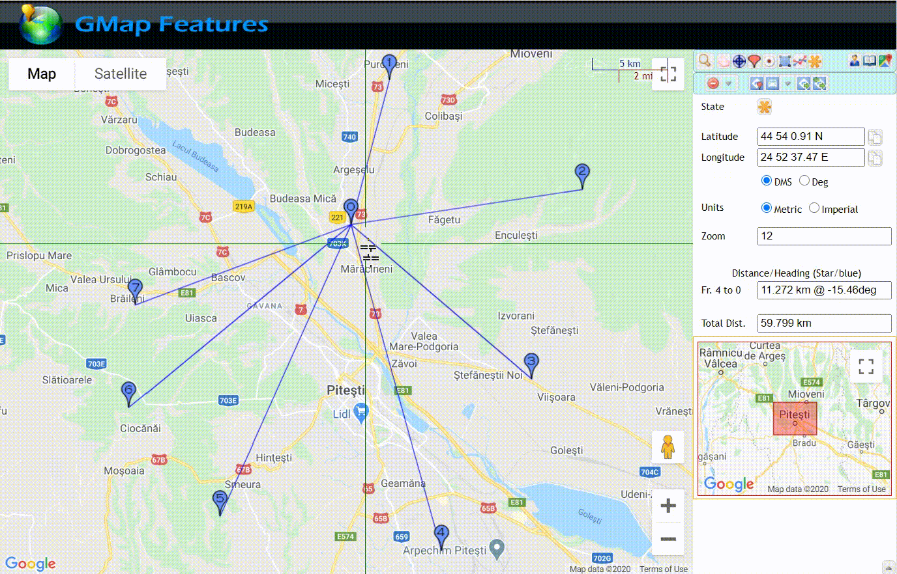

This is a GIF  montage demo of GMAP Features, a Google maps web app that uses several of its Map SDK API.

You can find the link [here](https://gmapfeatures.s3.us-east-2.amazonaws.com/index.html) and you can find a quick guide [here](https://gmapfeatures.s3.us-east-2.amazonaws.com/guide/index.html).

# Flooding simulation
This shows how you can use the app to simulate path flooding where you can determine its depth on any particular point in the path.

# LOS (Line-of-Sight) simulation
You will be able to detect obstruction on any point on a path with this feature. This will simply tell you the vertical height clearance between the ground and the traced path off air. Negative value means it is below ground level which also means it is obstructed.

K-factor ranges from 0 to 1 for the earth curvature. 0 means flat earth and 1 means using the full curvature of earth. In surveying point-to-point microwave signal in telecoms field, 0.75 is the normal value because radio wave tend to bend upward on the atmosphere. For analysis, that bend is usually applied on the earth instead of the radio path itself. It means that the radio path is made straight and its upward bend is applied and deducted from the earth's curvature, making the K-factor equals 0.75.

# Star topology
This will allow you to create a star topology and move around its center or any of its end node markers to determine the optimal or minimum total distance for your project. This will also determine bearing/azimuth to and fro center point to any of its end points.

# Radius
This will simply draw circle as an overlay on the map. You can determine its radius, circumference, and you can drag it around.

