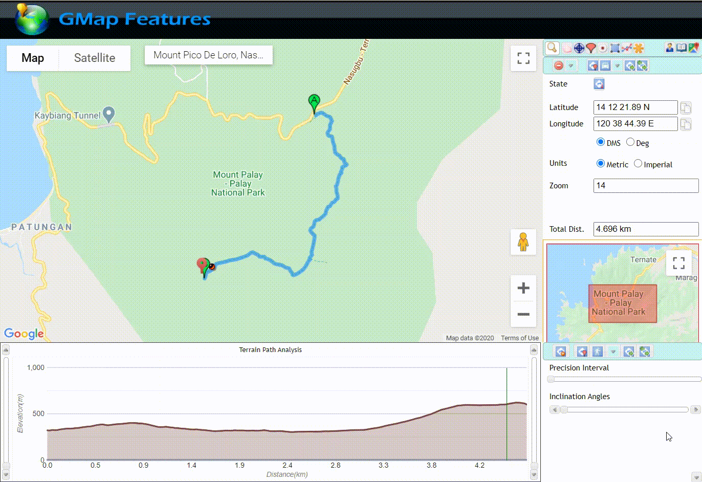
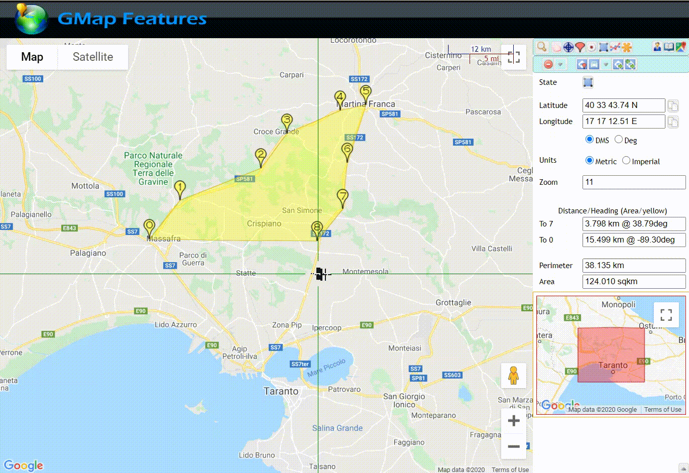
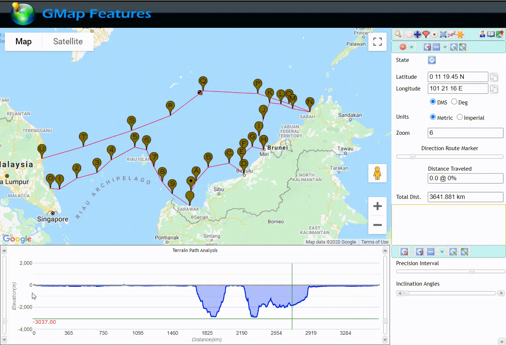

This is a GIF  montage demo of GMAP Features, a Google maps web app that uses several of its Map SDK API.

You can find the link [here](https://gmapfeatures.s3.us-east-2.amazonaws.com/index.html) and you can find a quick guide [here](https://gmapfeatures.s3.us-east-2.amazonaws.com/guide/index.html).

# Flooding simulation
This shows how you can use the app to simulate path flooding where you can determine its depth on any particular point in the path.

# LOS (Line-of-Sight) simulation
You will be able to detect obstruction on any point on a path with this feature. This will simply tell you the vertical height clearance between the ground and the traced path off air. Negative value means it is below ground level which also means it is obstructed.

K-factor ranges from 0 to 1 for the earth curvature. 0 means flat earth and 1 means using the full curvature of earth. In surveying point-to-point microwave signal in telecoms field, 0.75 is the normal value because radio wave tend to bend upward on the atmosphere. For analysis, that bend is usually applied on the earth instead of the radio path itself. It means that the radio path is made straight and its upward bend is applied and deducted from the earth's curvature, making the K-factor equals 0.75.

# Inclination angle
You can get the highest or the lowest inclination angle of a given path. This is useful in a couple of scenarios like if you are planning a mountain hike, skiing, or off roading that you want to know the steepest path you or your vehicle needs to negotiate along the way. 

> The value here is computed on approximate estimate based on elevation points along the path. Please note this will not take into consideration any man-made structure as an elevation point such as bridges, elevated footpath or buildings.

# Star topology
This will allow you to create a star topology and move around its center or any of its end node markers to determine the optimal or minimum total distance for your project. This will also determine bearing/azimuth to and fro center point to any of its end points.

# Radius
This will simply draw circle as an overlay on the map. You can determine its radius, circumference, and you can drag it around.

# Enclosed area
This will give you the area and perimeter distance.

# Ocean deep
This is an approximate layout path for a submarine cable in Malaysian Peninsula. You can survey the depth of the path underneath the ocean even before implementing any project from it.

# Multiple overlay objects
This just shows the possibility to place multiple overlay objects on the map canvas and hover on it to see any path or any marker/node details.

